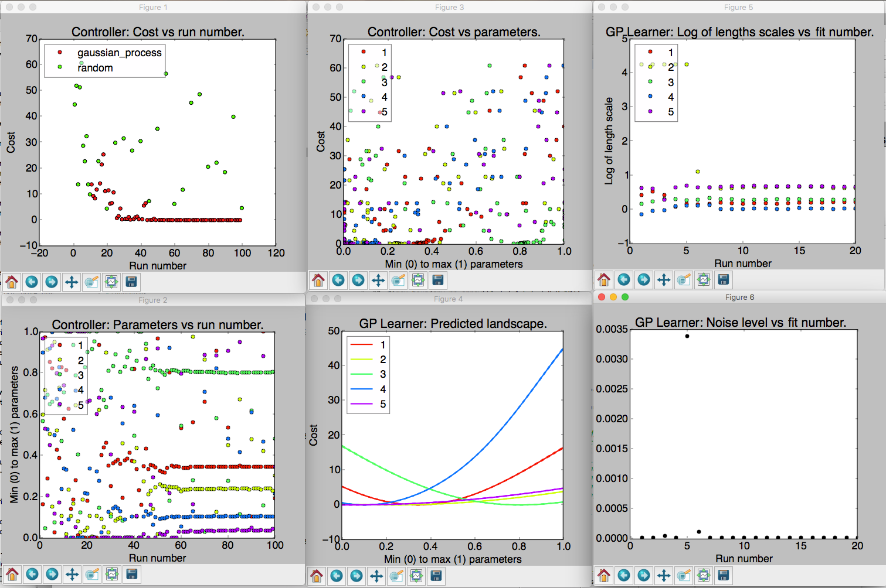

.. _sec-visualizations:

==============
Visualizations
==============

At the end of an optimization run a set of visualizations will be produced by default.

   
   An example of the six visualizations automatically produced when M-LOOP is run with the default controller, the Gaussian process machine learner.
   
The number of visualizations, and what they show, will depend on what controller type you use.
Generally there will always be three plots that present the data from the controller.
In addition, for most controller types there will be more plots which present data gathered by the learner.
The information presented in these plots is explained below.
The plots which start with *Controller:* are generated from the controller archive, while plots that start with *Learner:* are generated from the learner archive. 

Often optimization runs can involve many parameters, which can make the plots that display values of different parameters too busy and difficult to interpret.
To avoid this issue, low-level plotting functions support an optional ``parameter_subset`` argument.
Passing a list of indices for ``parameter_subset`` instructs those functions to only display the data for the parameters corresponding to those indices.
The high-level plotting functions, i.e. the ones that generate all of the plots that are implemented for a given archive, instead support an optional ``max_parameters_per_plot`` argument.
When that argument is provided, plots with many parameters will be broken up into several different plots, each displaying the data for at most ``max_parameters_per_plot`` arguments.

Occasionally the legend can obscure some of the data in the plots.
The positions of legends can be adjusted by calling :meth:`mloop.visualizations.set_legend_location`, which accepts any of the values that can be used for ``loc`` in ``matpotlib``'s ``legend()`` function.
For example, to set the legend outside of the plot, you can use ``set_legend_location((1, 0))``.
Note that ``set_legend_location()`` must be called before generating a plot in order for it to have an effect.
To move the legend in an existing plot, call ``set_legend_location()`` then recreate the plot.

Controller Visualizations
=========================

Regardless of controller type, there are always three plots produced for the controller.
These are as follows:

- **Controller: Cost vs run number.**
  Here the cost returned by the experiment versus run number is plotted.
  The legend shows what algorithm was used to generate the parameters tested by the experiment.
  If you use the Gaussian process or neural net, there will also be another algorithm used throughout the optimization algorithm in order to (a) ensure parameters are generated fast enough and (b) add new prior free data to ensure the Gaussian process converges to the correct model.

- **Controller: Parameters vs run number.**
  The parameters values are all plotted against the run number.
  Note the parameters will all be scaled between their minimum and maximum value.
  The legend indicates which color corresponds to which parameter. 

- **Controller: Cost vs parameters.**
  The cost versus the parameters.
  Here each of the parameters tested are plotted against the cost they returned as a set.
  Again the parameter values are all scaled between their minimum and maximum values.

Learner Visualizations
======================

Which visualizations are generated to display results from the learner depend on what learner was used for the optimization.
Each section below describes the plots produced by a different learner.

Gaussian Process
----------------

- **GP Learner: Predicted landscape.**
  1D cross sections of the predicted cost landscape about point with the best recorded cost are plotted for each parameter.
  The color of the cross section corresponds to the parameter that is varied in the cross section.
  This predicted landscape is generated by the model fit to the experiment by the Gaussian process.
  Be sure to check after an optimization run that all parameters contributed.
  If one parameter produces a flat cross section, it is most likely it did not have any influence on the final cost.
  You may want to remove it on the next optimization run. 

- **GP Learner: Log of length scales vs fit number.**
  The Gaussian process fits a correlation length to each of the parameters in the experiment.
  Here we see a plot of the correlation lengths versus fit number.
  The last correlation lengths (highest fit number) are the most reliable values.
  Correlation lengths indicate how sensitive the cost is to changes in these parameters.
  If the correlation length is large, the parameter has a very little influence on the cost; if the correlation length is small, the parameter will have a very large influence on the cost.
  The correlation lengths are not precisely estimated.
  They should only be trusted accurate to +/- an order of magnitude.
  If a parameter has an extremely large value at the end of the optimization, say 5 or more, it is unlikely to have much affect on the cost and should be removed on the next optimization run.

- **GP Learner: Noise level vs fit number.**
  This is the estimated noise in the costs as a function of fit number.
  The most reliable estimate of the noise level will be the last value (highest fit number).
  The noise level is useful for quantifying the intrinsic noise and uncertainty in your cost value.
  Most other optimization algorithms will not provide this estimate.
  The noise level estimate may be helpful when isolating what part of your system can be optimized and what part is due to random fluctuations.
  This plot will only be generated if the ``cost_has_noise`` option was set to ``True``.

Neural Net
----------

- **Neural Net Learner: Predicted Landscape.**
  The neural net learner visualizer produces a plot showing 1D cross sections of the predicted cost about the point with the best recorded cost, just as the Gaussian learner visualizer does.
  The main difference is that the neural net learner will actually produce multiple instances of this kind of plot.
  The first few show the results predicted by each of the independent neural nets.
  The last one shows the average of the costs predicted by each independent neural net, as well as dashed lines showing the maximum and minimum values predicted by any neural net for each point.

- **Neural Net Learner: Cost Surface.**
  This plot is only generated if the optimization had two parameters.
  It plots the predicted cost landscape as a surface in a 3D space where the x and y axes are the optimization parameters and the z axis shows the predicted cost.

- **Neural Net Learner: Cost Surface Density.**
  This plot is also only generated if the optimization had two parameters.
  It shows the same data as the cost surface plot, except that the predicted cost is plotted using a color scale rather than using a third dimension.

- **Neural Net Learner: Loss vs Epoch.**
  While fitting the neural nets their loss is calculated, which is a measure of how well the predicted cost fits the measured values.
  In M-LOOP this is measured as the mean of the square of the deviation between the predicted and measured values, plus a contribution from the regularization loss which is used to reduce overfitting.
  Each neural net records its loss every ten training epochs.
  This plot displays those recorded losses.
  Note that an "epoch" here is not the same as a run of the experiment.
  One epoch corresponds to one iteration over the full data set while fitting a neural net.
  Generally the fitting routine will go through many epochs during one fit, and the number of epochs per fit will vary.
  

Differential Evolution
----------------------

- **Differential Evolution Learner: Parameters vs Generation.**
  This plot displays the values tried for each of the parameters for each generation.
  Because there are multiple runs per generation, there are many points for each parameter within each generation.

- **Differential Evolution Learner: Costs vs Generation.**
  This plot displays the measured costs for each generation.
  Because there are multiple runs per generation, there are many different values for the cost plotted for each generation.

Nelder–Mead
-----------

As of yet there is no visualization class implemented for the Nelder–Mead learner.
The controller's archive may still be plotted though when Nelder–Mead is used.

Random
------

As of yet there is no visualization class implemented for the random learner.
The controller's archive may still be plotted though when the random controller is used.

Reproducing visualizations
==========================

If you have a controller and learner archive and would like to examine the visualizations again, it is best to do so using the :ref:`sec-api`.
For example the following code will plot the visualizations again from the files *controller_archive_2016-08-23_13-59.mat* and *learner_archive_2016-08-18_12-18.pkl*::

   import mloop.visualizations as mlv
   
   mlv.configure_plots()
   mlv.show_all_default_visualizations_from_archive(
       controller_filename='controller_archive_2016-08-23_13-59.mat',
       learner_filename='learner_archive_2016-08-18_12-18.pkl',
   )
